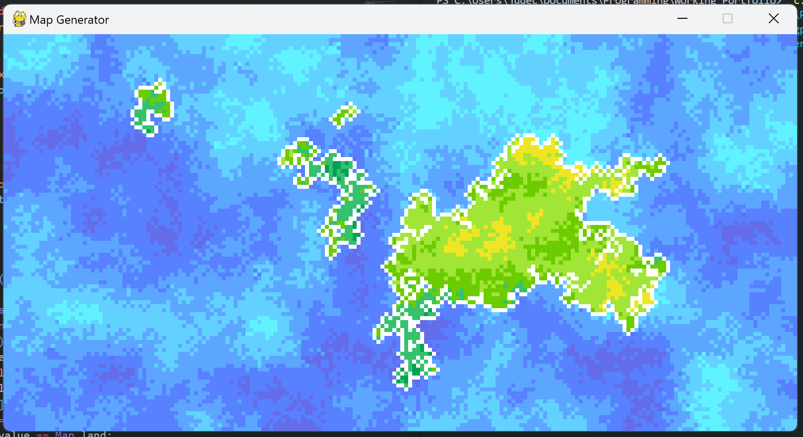
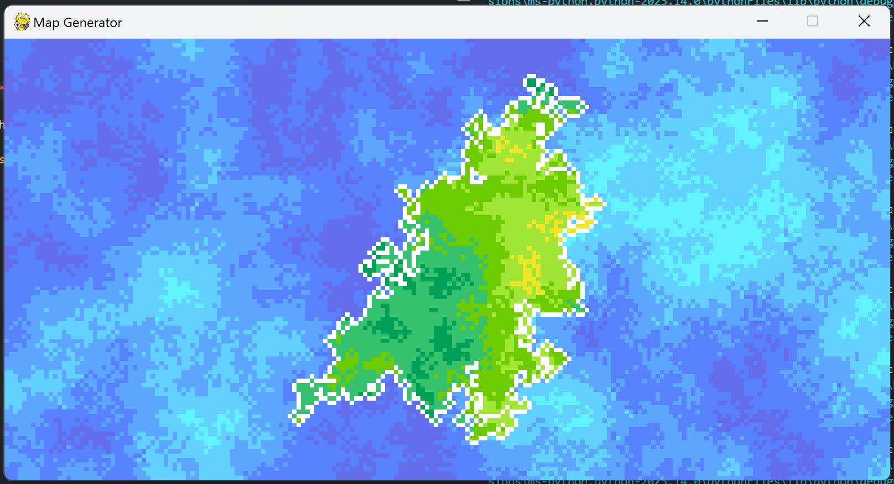
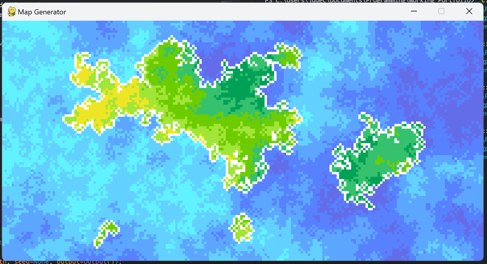
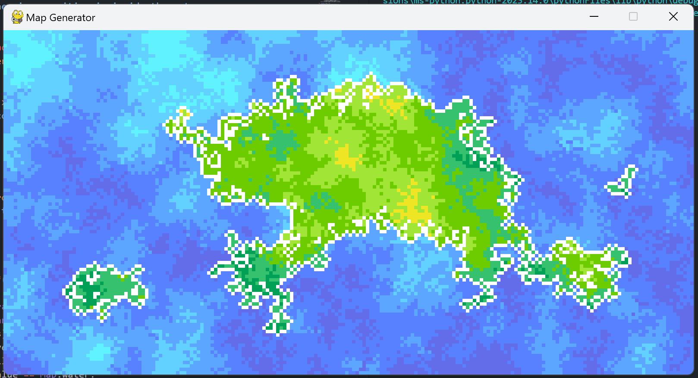

# map-generator
Generates maps using a algorithm inspired by the wave function collapse quantum phenomena.

The program uses a variation of the wave function collapse algorithm, except instead of finding the tiles with the fewest possibilities/most adjacent collapsed tiles, this implementation uses a pre-determined order and uses tiles that have at least one collapsed adjacent tile which produces more interesting maps and takes a significantly shorter time.

## Usage
Variable dimensions can be provided, however larger maps take an exponentially longer time, a seed can also be provided to produce identical maps as long as the dimensions remain the same.

An output object should be provided, the default is a stripped output object. I've implemented a built-in output using pygame to display the map during generation.

```py
import map_rewrite
import map_output

output = map_output.PyGame(100, 100, 4)
map = map_rewrite.Map(100, 100, output=output)

def main_loop():
    map.generate_landmass()
    map.remove_lone_tiles(threshold=1)
    map.centre_landmass()
    map.generate_heatmap()
    map.soften_heatmap()
    map.outline_landmass()

output.run(main_loop)
```

## Examples



